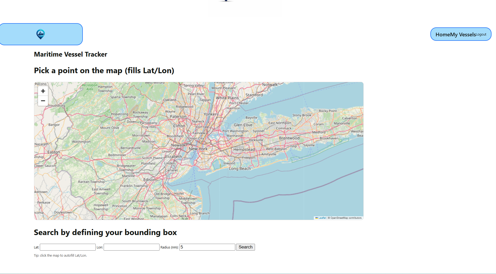

# Maritime Vessel Tracker

The perfect app for testing your patience with API providers!

## Description

The Maritime Vessel Tracker is a full-stack DJANGO application that allows users to utilize the Marinesia API to search for Automatic Identification System (AIS) "pings" from vessels in a specific bounding box. More on AIs here: (https://en.wikipedia.org/wiki/Automatic_identification_system)

Users can:
- Call the Marinesia API (if it's working and not blocked by CloudFlare...) for vessels within a user defined "bounding box" (search area)
- View a list of vessels within the bounding box to include vessel information and the latest positional data
- Select which vessels to add to the user's "My Vessels" page
- Perform CRUD on vessels in My Vessels

---

## Background

I created the Maritime Vessel Tracker to practice calling and ingesting APIs from paid providers. As an avid sailor, AIS has a specific place in my heart for the mulitple times it alerted me to large vessels in my area while I was piloting into unfamiliar harbors at night.

---

## Getting Started

### Deployed App
[Click here to use the Maritime Tracker App](https://maritime-vessel-tracker.onrender.com)

### Planning Materials
- [Trello Board](https://trello.com/b/MVAwuplr/maritime-ais-tracker)

---

## Technologies Used
- Django
- Python
- HTML
- CSS
- PSQL

### Tools & Deployment
- Git & GitHub
- VS Code
- Render.com

---

## Attributions

- OpenAI (ChatGPT) — logo generation, error handling, and debugging
- Leaflet - interactive map for assisting users in choosing a lat/long for the bounding box

---

## Next Steps / Stretch Goals

- Add images and historical location tracks to the Vessel Detail page
- Add a user's gps location to show relative location to other vessels
- Overlay course-over-ground and speed-over-ground onto interactive map
- Refine CSS